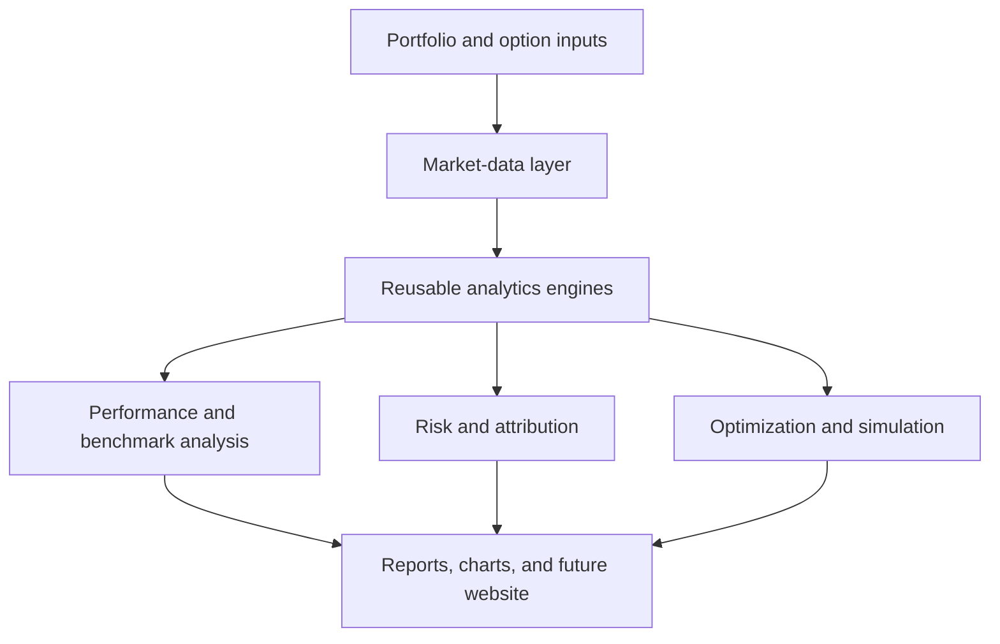

# Quantitative Portfolio & Options Analytics Engine

A modular Python platform for derivatives pricing, portfolio performance analysis, risk measurement, benchmark attribution, Monte Carlo simulation, and constrained portfolio optimization.

The project combines two related quantitative-finance systems:

1. An options-pricing engine for theoretical valuation, Greeks, implied volatility, and model comparison.
2. A portfolio-analytics engine for performance measurement, risk attribution, benchmark analysis, Value at Risk, and mean-variance optimization.

The application uses live market data and is structured so the analytics engine can later power an interactive web interface.

## Key Features

### Options and Derivatives

- European call and put pricing using Black–Scholes
- Option Greeks:
  - Delta
  - Gamma
  - Vega
  - Theta
  - Rho
- Implied-volatility calculation using numerical bisection
- European no-arbitrage price validation
- Put-call parity checks
- Live stock and option-chain data through `yfinance`
- Historical volatility from annualized log returns
- Call and put implied-volatility smiles
- European and American binomial-tree pricing
- American-option early-exercise modeling
- Monte Carlo option pricing
- Cross-model comparison between:
  - Black–Scholes
  - Binomial tree
  - Monte Carlo simulation

### Portfolio Performance

- Configurable tickers and portfolio weights
- Adjusted historical market-price retrieval
- Daily asset and portfolio returns
- Cumulative return
- Historical portfolio-value simulation
- Total return
- Geometric annualized return
- Annualized volatility
- Covariance and correlation matrices
- Covariance-based portfolio volatility

### Risk-Adjusted Performance

- Sharpe ratio
- Sortino ratio
- Historical drawdown series
- Maximum drawdown
- Calmar ratio

### Benchmark Analysis

- Configurable benchmark, with SPY as the default
- Portfolio beta
- Jensen’s alpha
- Tracking error
- Information ratio
- Date alignment between portfolio and benchmark observations

### Value at Risk and Expected Shortfall

Three risk methodologies are supported:

- Historical VaR and expected shortfall
- Parametric VaR and expected shortfall
- Correlated multi-asset Monte Carlo VaR and expected shortfall

Risk estimates are provided as both:

- Percentage returns
- Dollar-loss estimates based on current portfolio value

### Portfolio Attribution

- Annualized return contribution by asset
- Marginal volatility contribution
- Component volatility contribution
- Percentage contribution to total portfolio risk

### Portfolio Optimization

- Current portfolio risk-return statistics
- Long-only minimum-volatility portfolio
- Long-only maximum-Sharpe portfolio
- Configurable maximum position weight
- Fully invested portfolio constraint
- Efficient-frontier generation
- Comparison of current and optimized allocations

### Holdings and Strategy Comparison

- Daily-rebalanced portfolio simulation
- Buy-and-hold share calculation
- Weight drift through time
- Ending buy-and-hold allocation
- Side-by-side strategy comparison
- Comparison of:
  - Final value
  - Total return
  - Annualized return
  - Annualized volatility
  - Sharpe ratio
  - Maximum drawdown

### Visualization and Reporting

- Efficient-frontier chart
- Daily-rebalanced versus buy-and-hold growth chart
- Monte Carlo return-distribution chart
- Implied-volatility smile charts
- Structured command-line report
- Reusable analysis dictionary for future web integration

## Architecture



The codebase separates data access, financial calculations, orchestration, visualization, and reporting. This allows individual models to be tested independently and reused by a command-line interface or web application.

## Installation

Clone the repository:

```bash
git clone https://github.com/brianengel7/quant-options-engine.git
cd quant-options-engine
```

Create a virtual environment:

```bash
python -m venv .venv
```

Activate it on Linux or macOS:

```bash
source .venv/bin/activate
```

Activate it on Windows PowerShell:

```powershell
.venv\Scripts\Activate.ps1
```

Install the dependencies:

```bash
python -m pip install --upgrade pip
pip install -r requirements.txt
```

## Running the Portfolio Analysis

Run commands from the repository root:

```bash
python -m src.portfolio
```

The example configuration analyzes:

```python
tickers = ["AAPL", "MSFT", "JPM"]

weights = {
    "AAPL": 0.40,
    "MSFT": 0.35,
    "JPM": 0.25
}
```

The analysis includes:

- Portfolio performance
- Risk-adjusted metrics
- SPY benchmark comparison
- Historical, parametric, and Monte Carlo risk
- Asset-level contributions
- Portfolio optimization
- Efficient frontier
- Buy-and-hold comparison
- Generated charts

Charts are written to the generated `outputs/` directory.

## Reusing the Portfolio Engine

The complete analysis can be called independently of the command-line report:

```python
from src.portfolio_engine import run_portfolio_analysis


analysis = run_portfolio_analysis(
    tickers=["AAPL", "MSFT", "JPM"],
    weights={
        "AAPL": 0.40,
        "MSFT": 0.35,
        "JPM": 0.25
    },
    start_date="2025-01-01",
    initial_investment=100_000,
    benchmark_ticker="SPY",
    risk_free_rate=0.04,
    confidence_level=0.95,
    maximum_position_weight=0.60,
    number_of_simulations=10_000,
    monte_carlo_horizon_days=1,
    monte_carlo_rebalancing_mode="daily",
    frontier_points=50,
    trading_days=252,
    random_seed=42
)

print(analysis["performance"])
print(analysis["risk"]["historical"])
print(analysis["optimization"]["maximum_sharpe"])
```

`run_portfolio_analysis()` returns structured results containing:

- Inputs
- Return histories
- Performance statistics
- Risk-adjusted metrics
- Benchmark statistics
- VaR and expected shortfall
- Covariance and correlation matrices
- Asset contributions
- Optimization results
- Buy-and-hold results
- Strategy comparison
- Data used in the analysis

This reusable interface is designed to support the future web application.

## Options Example

A Black–Scholes call price can be calculated directly:

```python
from src.black_scholes import calculate_call_price


call_price = calculate_call_price(
    100,
    105,
    0.5,
    0.05,
    0.30
)

print(f"Call price: ${call_price:.2f}")
```

The options modules also support implied-volatility recovery, Greeks, binomial-tree valuation, and Monte Carlo pricing.

### Monte Carlo Risk

The Monte Carlo model:

1. Estimates daily mean returns and the covariance matrix.
2. Generates correlated asset returns.
3. Aggregates simulated asset paths using portfolio weights.
4. Calculates the simulated portfolio-return distribution.
5. Estimates VaR and expected shortfall from the simulated lower tail.

A configurable random seed makes results reproducible.

## Implied-Volatility Methodology

Implied volatility is the volatility input that causes the Black–Scholes model price to equal an observed option price.

Because Black–Scholes cannot be algebraically rearranged to isolate volatility, the engine uses bisection:

1. Establish a volatility search interval.
2. Calculate its midpoint.
3. Calculate the Black–Scholes price at that volatility.
4. Compare the model price with the observed market price.
5. Retain the half of the interval containing the solution.
6. Repeat until the pricing difference falls within the tolerance.

The implementation supports calls and puts and rejects prices outside European no-arbitrage bounds before beginning the numerical search.

## Volatility Smile Construction

The engine builds call and put volatility smiles from live option-chain data by:

1. Removing contracts with invalid or missing bid-ask quotes.
2. Filtering contracts to a configurable strike range around the current stock price.
3. Calculating the market midpoint:

## Testing

The project uses `pytest` for unit and integration testing.

Run the complete suite from the repository root:

```bash
python -m pytest -q
```

Run with verbose output:

```bash
python -m pytest -v
```

The test suite covers:

- Black–Scholes pricing
- Implied-volatility recovery
- Invalid option-price rejection
- European no-arbitrage bounds
- Binomial-tree convergence
- American-option early exercise
- Monte Carlo option pricing
- Portfolio performance metrics
- Benchmark calculations
- Historical, parametric, and Monte Carlo risk
- Return and volatility contributions
- Buy-and-hold calculations
- Portfolio optimization and constraints
- Full portfolio-engine integration

The integration test replaces live downloads with deterministic market data so the complete engine can be tested without internet access.

## Project Structure

```text
quant-options-engine/
├── src/
│   ├── binomial_tree.py
│   ├── black_scholes.py
│   ├── greeks.py
│   ├── implied_volatility.py
│   ├── market_data.py
│   ├── monte_carlo.py
│   ├── option_metrics.py
│   ├── portfolio.py
│   ├── portfolio_benchmark.py
│   ├── portfolio_contributions.py
│   ├── portfolio_data.py
│   ├── portfolio_engine.py
│   ├── portfolio_holdings.py
│   ├── portfolio_metrics.py
│   ├── portfolio_optimization.py
│   ├── portfolio_reporting.py
│   ├── portfolio_risk.py
│   └── portfolio_visualizations.py
├── tests/
│   ├── conftest.py
│   ├── test_binomial_tree.py
│   ├── test_black_scholes.py
│   ├── test_implied_volatility.py
│   ├── test_monte_carlo.py
│   ├── test_portfolio_benchmark.py
│   ├── test_portfolio_contributions.py
│   ├── test_portfolio_engine.py
│   ├── test_portfolio_holdings.py
│   ├── test_portfolio_metrics.py
│   ├── test_portfolio_optimization.py
│   └── test_portfolio_risk.py
├── .gitignore
├── pytest.ini
├── README.md
└── requirements.txt
```

The `outputs/` directory is generated when portfolio visualizations are saved.

## Assumptions and Limitations

- Historical performance does not predict future performance.
- Expected returns and covariance are estimated from the selected historical sample.
- Parametric risk assumes normally distributed returns.
- Monte Carlo results depend on estimated means, covariance, and distribution assumptions.
- The optimization model is sensitive to historical expected-return estimates.
- Portfolios are currently long-only and fully invested.
- Transaction costs, taxes, slippage, and market impact are excluded.
- The daily-rebalanced model assumes weights can be restored each trading day without cost.
- SPY is only the default benchmark; an appropriate benchmark depends on the portfolio.
- Market data quality and availability depend on `yfinance`.
- Option calculations rely on their respective model assumptions.
- Results are intended for education and analysis, not investment advice.

## Disclaimer

This project is for educational and demonstration purposes only. It does not provide investment advice, trading recommendations, or guarantees regarding future performance.